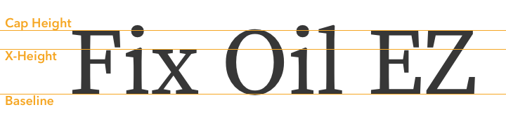

# CSS实用技巧（中）

## 前言

今年上半年，陆陆续续参加十来场前端招聘，发现很多前端er对`CSS`了解不是很多，如`vertical-align`、`BFC`、`position`等。本文简要的对`line-height`、`vertical-align`、`BFC`、`position`进行简单总结。从本文中，你将能了解到这些属性的实用技巧。

## 实用技巧

### line-height

`line-height`

- 默认文本对齐方式：基线对齐（`baseline`)

基线的定义：**字母x的下边缘（线）**
`x-height`的定义：字母`x`的高度

