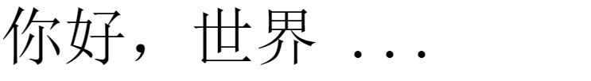

# CSS实用技巧（中）

## 前言

我们经常使用`CSS`，但是却不怎么了解`CSS`，本文主要对`vertical-align`、`BFC`、`position`中开发过程不怎么注意的特性进行简要总结，从本文中，你将了解到以下内容：

- `vertical-align`为何时灵时不灵
- `BFC`是什么？有何作用
- 绝对定位的奇淫技巧

## CSS特性

### vertical-align为什么时灵时不灵

#### 生效条件

只能应用在`display`为`inline`、`inline-block`、`inline-table`、`table-cell`上。

有个高频面试题，“如何使一个不定宽高`div`垂直水平居中？”，有的萌新竟然回答用`vertical-align: middle`。这个回答是减分的，至少在某种程度上给人一种感觉`CSS`基础比较薄弱。

#### 内联元素垂直居中对齐

开发中会遇到用字幕`x`代替关闭`icon`，用`...`显示溢出或者加载中。但是会发现字母`x`、省略号并没有与文本垂直方向居中对齐，这是因为文本默认是基线对齐，`x`、省略号默认底部在基线处。如下图所示：


如下，为文本对齐`demo`:

```html
<div class="container">
  <span>你好，世界</span>
  <span class="more">...</span>
</div>
```

实际显示效果如下：



如果要实现垂直居中，利用`vertical-align`，搭配`line-height`即可，`vertical-align`不仅可以设置`middle/top/bottom/baseline...`关键字，也可以设置常用的度量单位，正负值均可，使用比较灵活。为什么要给`.more`设置`line-height`属性呢？其实是因为`line-height`属性可以继承，如果不缩小`.more`的行高，就会撑大父元素的尺寸。

```html
<style>
  .container{
    font-size: 64px;
    line-height: 64px;
  }
  .more{
    line-height: 16px;
    vertical-align: 16px;
  }
</style>
```

### BFC究竟有什么作用

#### 什么是BFC

`BFC`全称`block formatting context`，即“块状格式化上下文”，与外界元素相对独立的一片区域，具有以下特性：

- 计算`BFC`高度时，浮动元素也参与计算
- 属于同一`BFC`容器的元素垂直方向的`margin`会合并
- `BFC`容器是独立容器，不会影响外部元素的布局

利用`BFC`的特性，我们可以实现以下功能：

1. 清除浮动
2. 防止垂直方向`margin`合并
3. 实现多栏弹性布局

#### BFC的生效条件

以下`CSS`属性会触发元素生成`BFC`结界:

- 根元素（`<html>`）
- 浮动元素（元素的 `float` 不是 `none`）
- 绝对定位元素（元素的 `position` 为 `absolute` 或 `fixed`）
- 行内块元素（元素的 `display` 为 `inline-block`）
- 表格单元格（元素的 `display` 为 `table-cell`，`HTML`表格单元格默认为该值）
- 表格标题（元素的 `display` 为 `table-caption`，`HTML`表格标题默认为该值）
- 匿名表格单元格元素（元素的 `display` 为 `table`、`table-row`、 `table-row-group`、`table-header-group`、`table-footer-group`（分别- 是`HTML table`、`row`、`tbody`、`thead`、`tfoot` 的默认属性）或 `inline-table`）
- `overflow` 计算值(`Computed`)不为 `visible` 的块元素
- `display` 值为 `flow-root` 的元素
- `contain` 值为 `layout`、`content` 或 `paint` 的元素
- 弹性元素（`display` 为 `flex` 或 `inline-flex` 元素的直接子元素）
- 网格元素（`display` 为 `grid` 或 `inline-grid` 元素的直接子元素）
- 多列容器（元素的 `column-count` 或 `column-width` 不为 `auto`，包括 `column-count` 为 1）
- `column-span` 为 `all` 的元素始终会创建一个新的`BFc`

#### BFC使用案例

- 清除浮动

```html
<style>
  .container{
    /* overflow: hidden; */
    /* position: absolute; */
    /* float: left; */
  }
  .left{
    float: left;
    width: 200px;
    height: 200px;
  }
</style>
<div class="container">
  <div class="left"></div>
</div>
```

以上代码，`container`容器高度为`0`，因为子元素`left`浮动。我们只需要把`container`容器转成`BFC`容器，即可清楚浮动，注释的几种方法都可以。

- 防止垂直方向`margin`合并

```html
<style>
  .blue, .red-inner {
    height: 50px;
    margin: 10px 0;
  }

  .blue {
    background: blue;
  }

  .red-outer {
    overflow: hidden;
    background: red;
  }
</style>
<div class="blue"></div>
<div class="red-outer">
  <div class="red-inner">red inner</div>
</div>
```

- 自适应布局

左侧固定，右侧自适应。

```html
<style>
  .left{
    height: 200px;
    width: 200px;
    float: left;
    background-color: burlywood;
  }
  .right{
    height: 200px;
    margin-left: 200px;
    background-color: cadetblue;
  }
</style>
<div class="container">
  <div class="left"></div>
  <div class="right"></div>
</div>
```

### 绝对定位还能玩出什么花样

#### 简介

绝对定位使用场景非常多。绝对定位元素脱离文档流，相对于最近的非 `static` 祖先元素定位，可以利用`left/right/top/bottom`定位元素位置。我们通常都是设置垂直方向与水平方向的的位置，如果四个方向都不设置或者四个方向都设置会出现什么彩蛋呢？下文会给出揭晓。

#### left/top/right/bottom都有值的定位

- 当对立位置（`left`与`right`，`top`与`bottom`）都设置值**且元素没用固定宽高**
  
此时元素的宽高是根据元素位置决定的，张鑫旭大佬在《`CSS`世界》中定义为格式化宽高，如下代码，最终`box-item`的宽高计算为：`width = 200 - 50 -50 = 100px;width = 200 - 50 -50 = 100px;`

```html
<style>
  .box{
    position: relative;
    width: 200px;
    height: 200px;
    margin: 50px;
    background-color: bisque;
  }
  .box-item{
    position: absolute;
    left: 50px;
    right: 50px;
    top: 50px;
    bottom: 50px;
    background-color: coral;
  }
</style>
 <div class="box">
    <div class="box-item"></div>
  </div>
```

这种行为特性对于我们做自适应布局非常有用，而且兼容性非常好，比如我们要做左侧固定宽度，右侧自适应，除了以上`BFC`的写法，我们还可以采用以下方法：

```html
<style>
  .container{
    position: absolute;
    top: 100px;
    bottom: 100px;
    left: 0;
    right: 0;
  }
  .left{
    position: absolute;
    top: 0;
    bottom: 0;
    width: 200px;
    background-color: burlywood;
  }
  .right{
    position: absolute;
    left: 200px;
    right: 0;
    top: 0;
    bottom: 0;
    background-color: cadetblue;
  }
</style>
<div class="container">
  <div class="left"></div>
  <div class="right"></div>
</div>
```

- 当对立位置都设置了值且元素设置了固定宽高

这个时候你会发现，元素的宽高时以`width/height`为准，上述说的格式化宽度、高度并没有生效。这是因为在高度计算过程中，元素的内部尺寸优先级大于外部尺寸，`width/height`影响的是元素内部尺寸，绝对定位影响的是外部尺寸，当元素绝对定位四个方向都设置值，此时外部尺寸会被内部尺寸覆盖，导致实际元素宽度是`width/height`的值。

我们经常用`margin: 0 auto;`实现元素水平居中，但是不定宽高元素垂直水平居中就有些麻烦。但是有个神奇的现象，绝对定位配合`margin: auto;`，可以实现元素垂直水平居中，如下所示：

```html
<style>
  .box{
    position: relative;
    width: 200px;
    height: 200px;
    margin: 50px;
    background-color: bisque;
  }
  .box-item{
    position: absolute;
    margin: auto;
    width: 50px;
    height: 50px;
    left: 0;
    right: 0;
    top: 0;
    bottom: 0;
    background-color: coral;
  }
</style>
<div class="box">
  <div class="box-item"></div>
</div>
```

出现这种现象是因为`margin:auto`本质上是平分元素剩余可用空间，块级元素一般是水平方向自动充满，垂直方向顺序排列。平常我们用`margin: 0 auto;`之所以能够使块级元素水平居中，是因为水平方向元素存在剩余可用空间，而`auto`平分剩余可用空间，因此就产生居中效果。而垂直方向不存在剩余可用空间，因此无法垂直居中。
上述`demo`，`box-item`之所以能够垂直居中，得益于`top/bottom`设置了值，使元素产生高度`100%`的外部尺寸，而`width/height`固定元素的内部尺寸，使得 **外部尺寸高度-内部尺寸高度=元素剩余可用空间高度**，而`auto`等分剩余可用空间，可以使元素达到垂直居中效果。可以尝试调整四个方向的值，看看`box-item`位置是怎么移动的。

#### 无依赖的绝对定位

当绝对定位没有设置四周定位尺寸时，会发生神奇的一幕，当前元素没有相对于最近的非 `static` 祖先元素定位，而是在当前位置不变，并且当前元素脱离文档流，不占据页面空间。这个特性某些情况下非常有用，比如给`box-card`加一个图标，借助无依赖定位 + `padding/margin`即可。写法比较简洁，建议尝试一下。

## 小结

比起其他的开发语言，想要深入了解`CSS`，并不是一件容易事，大多数人都是停留在用的基础上，知道这个属性/方法，至于为什么会这样了解较少。张鑫旭大佬`CSS`高度让人叹为观止，继续加油吧！！！

## 参考资料

- 《`CSS`世界》
- [BFC](https://developer.mozilla.org/zh-CN/docs/Web/Guide/CSS/Block_formatting_context)
