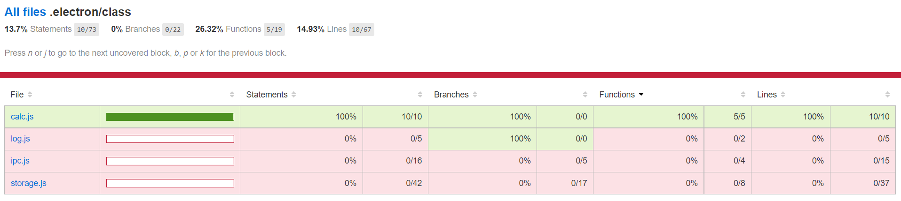

# 前端单元测试入门

## 简介

日常我们都忙于写`bug`，有时候不妨停下脚步，找找`bug`。测试广义上分为黑盒测试和白盒测试。单元测试属于后者，是在知道程序运行逻辑的基础上，设计测试用例，确保程序模块行为与我们预期一致。

前端做单元测试的不多，但是并不代表不必要，对于一些复杂的数据处理、公共类库等，单元测试是非常有必要的，代码只要有修改，就是有风险的，检验代码正确与否，最安全的方法就是通过设计的所有测试用例。通过本文，你将会收获以下内容：

1. `Node.js`中如何做单元测试，如何生成测试报告与测试覆盖率
2. `vue.js sfc`组件如何做单元测试

## `Node.js`单元测试

巧妇难为无米之炊，在做单元测试前，我们需要借助一款测试框架与一个断言库，测试框架是辅助我们**编写测试用例**，而断言主要是用来**判断预期输出与实际输出是否一致**。本文测试框架选用[mocha](https://mochajs.cn/)，断言采用[expect.js](https://github.com/Automattic/expect.js/)。

### CommonJS与ES6模块化区别

现在前端开发环境几乎都运行在`Node.js`中，只是最后打包成静态资源文件。所以单纯只想针对单纯项目中`JavaScript`文件进行单元测试，会因为模块化的差异而执行失败，因为`ES6`中使用的是`import/export`，而`CommonJS`中使用的是`require/module.exports`，想了解[Node.js 如何处理 ES6 模块](http://www.ruanyifeng.com/blog/2020/08/how-nodejs-use-es6-module.html)，可以参考阮老师文章。本文推荐一个第三方类库[esm](https://www.npmjs.com/package/esm)，仅需两步就能实现`Node.js`加载`ES6 module`。使用流程如下：

- 安装

```JavaScript
npm install esm -D
```

- 使用

```JavaScript
const $require = require('esm')(module)
// 注意：如果是export default，导入的模块需要通过.default获取
const TestModule = $require('ES6Module.js')
```

### 测试代码

以下为测试代码，主要测试加法运算及函数柯里化处理过程是否正确。

```JavaScript
class Calc {
  constructor() {
    this.add = this.addFun()
  }
  // 函数柯里化
  addFun () {
    let args = []
    let calcFun = function (...params) {
      args = args.concat(params)
      return args.reduce((total, current) => {
        return total + current
      }, 0)
    }

    calcFun.clear = function () {
      args = []
    }

    return calcFun
  }
}

export default = Calc
```

### 编写测试用例

测试框架采用`mocha`，一般编写单元测试用例，离不开`describe`和`it`。`describe`类似于开发中的`class`，是一类测试用例的集合；`it`相当于普通`function`，是一个具体测试用例实现。如下为简单的测试用例，简单罗列了普通测试与异步测试的基本使用，更多使用方法可以参考[mocha官网](https://mochajs.cn/)

```JavaScript
const Calc = require('../class/calc.js')
const expect = require('expect.js')

const calcInstance = new Calc()
describe('Test calc add operation', function () {
  it('should 1 + 2 === 3', function () {
    expect(calcInstance.add(1, 2)).to.be(3)
  });

  it('should summary + 2 === 4', function () {
    expect(calcInstance.add(2)).to.be(5)
  });

  it('should 1 + 2 === 3 after clear', function () {
    // 指定当前测试用例超时时间
    this.timeout(0)
    calcInstance.add.clear()
    // 异步测试
    return new Promise(resolve => {
      setTimeout(() => {
        resolve()
      }, 2000)
    }).then(() => {
      expect(calcInstance.add(1, 2)).to.be(3)
    })
  });
})
```

### 单元测试指标

#### 覆盖率简述

**覆盖率**是单元测试核心指标，又细分为语句覆盖率(`Statements`)、分支覆盖率(`Branches`)、函数覆盖率(`Functions`)、行覆盖率(`Lines`)。一个比较好的单元测试用例，要保证被测试代码的关键逻辑都被测试用例覆盖到。如下为`Calc`类的单元测试覆盖率情况。



#### 单元测试覆盖率统计

开源组件[nyc](https://www.npmjs.com/package/nyc)可以帮助我们统计覆盖率情况。

- 安装

```JavaScript
npm install nyc -D
```

- 配置文件

```JavaScript
// nyc.config.js
module.exports = {
  all: true,
  include: [ // 包含测试文件
    "web/src/lib/**.js",
    ".electron/class/**.js",
    "web/src/**/*.js",
    "web/src/**/*.vue"
  ],
  exclude: [ // 排除测试文件
    "web/test/*.spec.js",
    ".electron/test/*.spec.js"
  ],
  checkCoverage: false, // 测试基准覆盖率
  reporter: ['text', 'html'] // 测试报告格式
}
```

- 使用

```JavaScript
// package.json
"test-add": "nyc mocha .electron/test/calc.spec.js"
```

### 可视化单元测试报告

`mocha`官方推荐使用`mochawesome`用于生成可视化测试报告，使用非常简单。

- 安装

```JavaScript
npm install mochawesome -D
```

- 使用

```JavaScript
// package.json
"test-add-reporter": "mocha .electron/test/calc.spec.js --reporter mochawesome --reporter-options reportDir=mochaReporter,reportFilename=addReporter"
```

### 注意事项

编写单元测试用例时，不仅要考虑测试覆盖率，还要考虑测试用例设计。合格的测试用例不仅**要包含正常情况输入输出，也要包含异常情况输入输出的判断**，不能以开发的思维去编写测试用例。

## vue组件的单元测试

