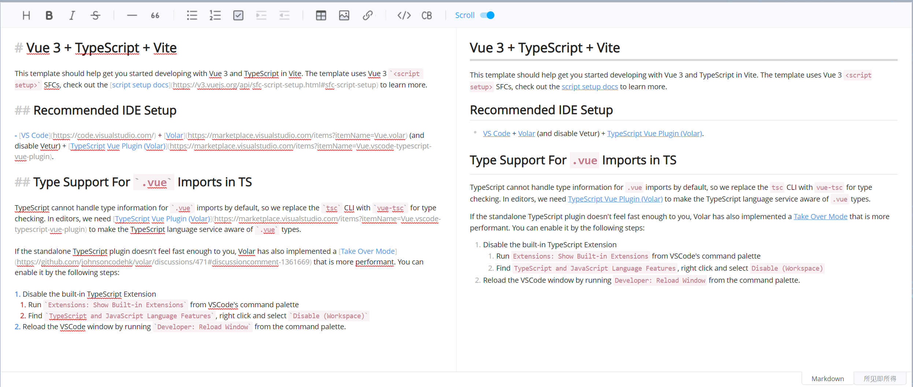
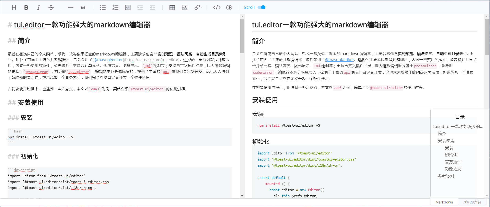

# tui.editor一款功能强大的markdown编辑器

## 简介

最近在捯饬自己的个人网站，想找一款类似于掘金的markdown编辑器，主要诉求包含**实时预览、语法高亮、自动生成目录索引**。对比了市面上主流的几款编辑器，最后采用了[@toast-ui/editor](https://ui.toast.com/tui-editor)。选择的主要原因就是开箱即用，内置一些实用的插件，如表格并且支持合并单元格、语法高亮、图形展示、`uml`绘制等；支持自定义插件扩展，因为这款编辑器是基于`prosemirror`，前身即`codemirror`，编辑器本身是偏底层的，提供了丰富的`api`供我们自定义开发，这也大大增强了编辑器的灵活性，如果想加一个目录索引，我们完全可以自定义开发一个插件使用。

在初次使用过程中，也遇到一些注意点，本文以`vue3`为例，简单介绍`@toast-ui/editor`的使用过程。

## 安装使用

### 安装

```bash
npm install @toast-ui/editor -S
```

### 初始化

```javascript
import Editor from '@toast-ui/editor'
import '@toast-ui/editor/dist/toastui-editor.css'
import '@toast-ui/editor/dist/i18n/zh-cn';

export default {
    mounted () {
      const editor = new Editor({
        el: this.$refs.editor,
        language: 'zh-CN',
        initialEditType: 'markdown',
        previewStyle: 'vertical',
      });
    }
  }
```

通过以上两步，我们就能得到一个简易的编辑器了，如下图所示：



显然我们的目的不仅如此，`markdown`编辑器还缺少语法高亮、目录栏，接下来我们看下如何扩展`tui`

### 官方插件

官方内置了以下插件：

| 插件名称 | 用途 |
| -- | -- |
| `@toast-ui/editor-plugin-chart` | 图形渲染 |
| `@toast-ui/editor-plugin-code-syntax-highlight` | 语法高亮 |
| `@toast-ui/editor-plugin-color-syntax` | 文本添加颜色 |
| `@toast-ui/editor-plugin-table-merged-cell` | 合并单元格 |
| `@toast-ui/editor-plugin-uml` | 渲染`UML` |

接下来我们配置代码语法高亮。

- 安装插件

```bash
npm install @toast-ui/editor-plugin-code-syntax-highlight
```

- 使用

```javascript
import 'prismjs/themes/prism.css';
import '@toast-ui/editor-plugin-code-syntax-highlight/dist/toastui-editor-plugin-code-syntax-highlight.css';
import Editor from '@toast-ui/editor';
// 支持所有语言语法高亮
import codeSyntaxHighlight from '@toast-ui/editor-plugin-code-syntax-highlight/dist/toastui-editor-plugin-code-syntax-highlight-all.js';

const editor = new Editor({
  // ...
  plugins: [codeSyntaxHighlight]
});
```

### 功能拓展

目前编辑器包含了语法高亮，如果需要添加目录索引，可以监听文档编辑的`change`事件，获取`markdown`文档内容，通过正则表达式解析即可。具体实现如下：

```javascript
const editor = new Editor({
  // ...
  events: {
    change: this.handleContentChange.bind(this)
  },
});

methods: {
  handleContentChange () {
    const mdText = this.editor.mdEditor.getMarkdown()
    this.parseMdTitle(mdText)
  },
  parseMdTitle (mdText) { // 解析markdown title
    const pattern = /^(#+)\s+(.+)/mg
    let result = mdText.match(pattern)
    if (!result) return
    const catalogList = result.map((vv, index) => {
      const levelText = vv.match(/^(#+)/)
      return {
        level: levelText[0].length, // 目录级别
        index,
        cls: `heading-${levelText[0].length}`,
        content: vv.slice(levelText[0].length).trim(), // 内容
      }
    })
    this.catalogList = catalogList
  }
}
```

以上仅仅是一些基础的使用。`markdown`基础语法无法满足我们需要时、需要手动修改渲染样式等需求，`tui.editor`也提供相应的能力。如需要修改标题的默认渲染样式，我们可以使用`customHTMLRenderer`，这一块官方文档较少，可以从源码看出默认书写规则，内置`schema`位置详见源码`libs\toastmark\src\html\baseConvertors.ts`。

```javascript
new Editor({
  // ...
  customHTMLRenderer: {
    heading (node, { entering }) {
      const spec = {
        type: entering ? 'openTag' : 'closeTag',
        tagName: `h${node.level}`,
        outerNewLine: true,
      };
      // 给每个header添加class
      if (entering) spec.attributes = {
        'class': `heading${node.level}`
      }
      return spec
    }
  }
})
```

最新`3.0`版本的编辑器是基于`Prosemirror`，有兴趣的小伙伴可以去看下，功能十分强大，也是`level1`级富文本编辑器的典型代表。

编辑器最终效果图如下：



## 实现源码

```html
<template>
  <div class="full">
    <div class="markdown-editor" ref="editor"></div>
    <div class="catalog-container" v-if="catalogList.length > 0">
      <div class="catalog-title">目录</div>
      <template v-for="(item, index) in catalogList" :key="index">
        <div class="catalog-item" :class="item.cls">
          <a :href="'#heading' + (index + 1)">{{item.content}}</a>
        </div>
      </template>
    </div>
  </div>
</template>

<script>
  import Editor from '@toast-ui/editor'
  import '@toast-ui/editor/dist/toastui-editor.css'
  import '@toast-ui/editor/dist/i18n/zh-cn';
  import 'prismjs/themes/prism.css';
  import '@toast-ui/editor-plugin-code-syntax-highlight/dist/toastui-editor-plugin-code-syntax-highlight.css';
  import codeSyntaxHighlight from '@toast-ui/editor-plugin-code-syntax-highlight/dist/toastui-editor-plugin-code-syntax-highlight-all.js';
  import '@toast-ui/editor-plugin-table-merged-cell/dist/toastui-editor-plugin-table-merged-cell.css';
  import tableMergedCell from '@toast-ui/editor-plugin-table-merged-cell';

  export default {
    data () {
      return {
        catalogList: []
      }
    },
    mounted () {
      this.editor = new Editor({
        el: this.$refs.editor,
        language: 'zh-CN',
        initialEditType: 'markdown',
        previewStyle: 'vertical',
        placeholder: '请输入内容',
        plugins: [codeSyntaxHighlight, tableMergedCell],
        events: {
          change: this.handleContentChange.bind(this)
        },
        customHTMLRenderer: {
          heading (node, { entering }) {
            const spec = {
              type: entering ? 'openTag' : 'closeTag',
              tagName: `h${node.level}`,
              outerNewLine: true,
            };
            // 添加自定义属性
            if (entering) spec.attributes = {
              'class': `heading${node.level}`
            }
            return spec
          }
        }
      })
    },
    methods: {
      handleContentChange () {
        const mdText = this.editor.mdEditor.getMarkdown()
        this.parseMdTitle(mdText)
      },
      parseMdTitle (mdText) { // 解析markdown title
        const pattern = /^(#+)\s+(.+)/mg
        let result = mdText.match(pattern)
        if (!result) return
        const catalogList = result.map((vv, index) => {
          const levelText = vv.match(/^(#+)/)
          return {
            level: levelText[0].length, // 目录级别
            index,
            cls: `heading-${levelText[0].length}`,
            content: vv.slice(levelText[0].length).trim(), // 内容
          }
        })
        this.catalogList = catalogList
      }
    }
  }
</script>

<style scoped>
  .full {
    position: relative
  }

  .catalog-container {
    box-sizing: border-box;
    position: absolute;
    right: 0;
    bottom: 32px;
    width: 200px;
    height: 300px;
    padding: 16px 0;
    background-color: rgba(255, 255, 255, .65);
    border: 1px solid #ccc;
    border-radius: 4px;
  }

  .catalog-title {
    text-align: center;
    padding-bottom: 12px;
  }

  .catalog-item {
    overflow: hidden;
    text-overflow: ellipsis;
    white-space: nowrap;
    padding: 4px 8px;
    font-size: 14px;
    user-select: none;
  }

  .catalog-item a {
    color: rgba(0, 0, 0, .65);
    text-decoration: none;
  }

  .heading-2 {
    padding-left: 24px;
  }

  .heading-3 {
    padding-left: 48px;
  }

  .catalog-item a:hover {
    color: cadetblue;
  }

  .markdown-editor {
    height: 100% !important;
    background: #fff;
    border-radius: 4px;
  }
</style>
```

## 参考资料

- [toastui/editor](https://nhn.github.io/tui.editor/latest/tutorial-example01-editor-basic)
- [tui.editor](https://github.com/nhn/tui.editor)
