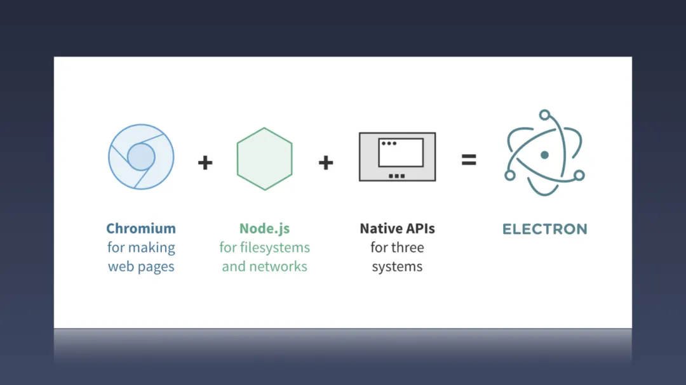

# Electron开发入门

## 一、Electron是什么

`Electron`是`GitHub`开发的一个开源框架。它允许使用`Node.js`（作为后端）和`Chromium`（作为前端）完成桌面`GUI`应用程序的开发。`Electron`现已被多个开源`Web`应用程序用于前端与后端的开发，著名项目包括`GitHub`的`Atom`和微软的`Visual Studio Code`。

与传统跨平台技术相比（如`QT`...），有以下特点：

- 优点
  - 跨平台：可以打包为`Mac`、`Windows`、`Linux`系统下的应用
  - 上手简单，开发成本较低：主要采用`HTML、CSS、JavaScript、Node.js`进行开发
- 缺点
  - 应用打包体积较大
  - 性能较差，打开窗体存在白屏

### 1.1 Electron应用架构



核心组成是由 `Chromium` + `Node.js` + `Native APIs` 组成的。其中 `Chromium` 提供了 `UI` 的能力，`Node.js` 让 `Electron` 有了底层操作的能力，`Navtive APIs` 则解决了跨平台的一些问题。


`Electron` 继承了来自 `Chromium`的多进程架构，这使得此框架在架构上非常相似于一个现代的网页浏览器。

每个 `Electron` 应用都有一个单一的主进程，作为应用程序的入口点。通过 `Electron` 的 `app` 模块来控制应用程序的生命周期。每打开一个`BrowserWindow`(窗口)，就会生成一个单独的渲染进程。主进程与渲染进程之间可以通过预加载脚本实现数据共享，可以暴露出主进程`API`供渲染进程使用。

### 1.2 常见的Electron应用

- `Atom`
- `VScode`

## 二、快速实现一个Electron应用

- 初始化项目

```JavaScript
npm install electron -D
```

- 设置启动脚本

```JavaScript
// package.json
{
  "script”: {
    "start": "electron ."
  }
}
```

- 创建HTML模板文件

```html
<!DOCTYPE html>
<html>
  <head>
    <meta charset="UTF-8">
    <meta http-equiv="Content-Security-Policy" content="default-src 'self'; script-src 'self'">
    <meta http-equiv="X-Content-Security-Policy" content="default-src 'self'; script-src 'self'">
    <title>Hello World!</title>
  </head>
  <body>
    <h1>Hello World!</h1>
    We are using Node.js <span id="node-version"></span>,
    Chromium <span id="chrome-version"></span>,
    and Electron <span id="electron-version"></span>.
  </body>
</html>

```

- 设置启动脚本

```JavaScript
const { app, BrowserWindow } = require('electron')

function createWindow () {
  const win = new BrowserWindow({
    width: 800,
    height: 600
  })

  win.loadFile('index.html')
}
// 只有在 app 模块的 ready 事件被激发后才能创建浏览器窗口
app.whenReady().then(() => {
  createWindow()
})

```

- 启动应用

```JavaScript
npm run start
```

## 三、窗口与展现

业务开发中，使用最多的就是`BrowserWindow`。

### 3.1 创建窗口

```JavaScript
const win = new BrowserWindow({
  width: 800, // 窗口宽度
  height: 600, // 窗口高度
  resizable: true, // 窗口大小是否可调整
  fullscreen: false, // 是否全屏
  title: '测试', // 窗口名称
  icon: 'logo.ico', // 窗口图标
  frame: false, // 是否是无边框窗口
  parent: null, // 父窗口
  backgroundColor: '#fff', // 窗口背景颜色
  modal: false, // 是否是模态窗口
  webPreferences: {
    devTools: false, // 是否开启DevTools
    nodeIntegration: true, // 允许渲染进程使用node，electron
    enableRemoteModule: true, // 可以启用webRTC
    webSecurity: false, // 禁用浏览器安全协议，否则打不开本地文件
    preload: path.resolve(__dirname, './preload.js') // 预加载脚本
  }
})


```

### 3.2 加载窗口资源文件

- `loadFile`
- `loadURL`

```JavaScript
win.loadFile('index.html')
win.loadURL('http://localhost:8080')
```

### 3.3 窗口事件

- `show`
- `hide`
- `blur`
- `ready-to-show`
- `resize`
- `move`
- `restore`
- `minimize`
- `maximize`
// ...

```JavaScript
win.on('ready-to-show', e => {
  console.log('ready-to-show')
})
// 阻止窗口关闭事件
window.onbeforeunload = (e) => {
  console.log('I do not want to be closed')
  //返回非空值将默认取消关闭
  e.returnValue = false
}

```

### 3.4 窗口实例方法

- `close`
- `focus`
- `show`
- `hide`
- `minimize`
- `maximize`
- `setFullScreen`
// ...

## 四、应用扩展功能

### 4.1 app

控制应用程序的生命周期事件。

#### 4.1.1 事件

- `window-all-closed`(所有的窗口都被关闭时触发)
- `before-quit`(在程序关闭窗口前触发,`event.preventDefault()`阻止窗口关闭)
- `activate`(应用程序被激活)
- `web-contents-created`(在创建新的 `webContents` 时发出)
- `render-process-gone`(渲染器进程意外消失时触发。 这种情况通常因为进程崩溃或被杀死。)
- `second-instance`(当第二个实例被执行并且调用 `app.requestSingleInstanceLock()` 时，这个事件将在你的应用程序的首个实例中触发)
// ...

#### 4.1.2 方法

- `whenReady`(`electron` 初始化完成)
- `quit`(关闭所有窗口)
- `exit`(立即退出)
- `relaunch`(重启应用)
- `disableHardwareAcceleration`(禁用当前应用程序的硬件加速。)
// ...

### 4.2 对话框

#### 4.2.1 基本使用

```JavaScript
const { dialog } = require('electron')
console.log(dialog.showOpenDialog({ properties: ['openFile', 'multiSelections'] }))
```

#### 4.2.2 模态框种类

- `showOpenDialog`
- `showSaveDialog`
- `showMessageBox`
- `showErrorBox`

### 4.3 菜单

#### 4.3.1 方法

- 静态方法

  - `setApplicationMenu(menu)`(设置窗口顶部菜单)
  - `buildFromTemplate`(设置应用内菜单)

- 实例方法

  - `popup`(显示菜单)
  - `closePopup`(关闭菜单)
  - `destroy`(销毁菜单)

#### 4.3.2 基本使用

```JavaScript
const remote = require('electron').remote;
const Menu = remote.Menu;
const MenuItem = remote.MenuItem;

var menu = new Menu();
menu.append(new MenuItem({ label: 'MenuItem1', click: function() { console.log('item 1 clicked'); } }));
menu.append(new MenuItem({ type: 'separator' }));
menu.append(new MenuItem({ label: 'MenuItem2', type: 'checkbox', checked: true }));

window.addEventListener('contextmenu', function (e) {
  e.preventDefault();
  menu.popup(remote.getCurrentWindow());
}, false);
```

### 4.4 快捷键

#### 4.4.1 静态方法

- `register`(注册全局快捷键)
- `registerAll`
- `isRegistered`
- `unregister`
- `unregisterAll`

#### 4.4.2 基本使用

```JavaScript
const { app, globalShortcut } = require('electron')

app.whenReady().then(() => {
  // Register a 'CommandOrControl+X' shortcut listener.
  const ret = globalShortcut.register('CommandOrControl+X', () => {
    console.log('CommandOrControl+X is pressed')
  })
  if (!ret) {
    console.log('registration failed')
  }
  // 检查快捷键是否注册成功
  console.log(globalShortcut.isRegistered('CommandOrControl+X'))
})

app.on('will-quit', () => {
  // 注销快捷键
  globalShortcut.unregister('CommandOrControl+X')
  // 注销所有快捷键
  globalShortcut.unregisterAll()
})

```

### 4.5 开机自启

#### 4.5.1 基本使用

```JavaScript
// 设置开机自启动
// 要区分开发环境与生产环境，否则可能导致开机启动两个electron窗口
if (args.mode !== 'development') {
    app.setLoginItemSettings({
        openAtLogin: true,
        openAsHidden:false,
        path: process.execPath
    })
}
```

#### 4.5.2 注意事项

- 查看开机自启是否注册成功

  - `win + R`,输入`msconfig`
  - 在系统配置中，启动`tab`页可以查看系统服务注册情况

## 五、进程间通信

### 5.1 简介

`electron`中，分为主进程和渲染进程。主进程负责控制整个应用的生命周期，渲染进程负责渲染网页内容。每新打开一个窗口，就会创建一个新的进程。进程与进程时间是隔离的，每个窗口都有独立的`window`对象，而要实现进程间通信，一般采用`electron`内置`ipc`模块。

### 5.2 进程间通信

#### 5.2.1 主进程与渲染进程间通信

```JavaScript
// 在主进程中.
const { ipcMain } = require('electron')
ipcMain.on('asynchronous-message', (event, arg) => {
  console.log(arg) // prints "ping"
  event.reply('asynchronous-reply', 'pong')
})

ipcMain.on('synchronous-message', (event, arg) => {
  console.log(arg) // prints "ping"
  event.returnValue = 'pong'
})
```

```JavaScript
//在渲染器进程 (网页) 中。
const { ipcRenderer } = require('electron')
console.log(ipcRenderer.sendSync('synchronous-message', 'ping')) // prints "pong"

ipcRenderer.on('asynchronous-reply', (event, arg) => {
  console.log(arg) // prints "pong"
})
ipcRenderer.send('asynchronous-message', 'ping')
```

#### 5.2.2 渲染进程与渲染进程间通信

```JavaScript
// ipc.js
const electron = require('electron')
const { remote, ipcRenderer } = electron
const { BrowserWindow } = remote

const currentWindow = remote.getCurrentWindow()

let ipc = {

  __listeners: [],
  //订阅消息
  on(channel, listener) {
    let callback = (e, payload) => listener(payload)

    this.__listeners.push(callback)
    ipcRenderer.on(channel, callback)

    return { channel, callback }
  },

  //移除监听器
  off(channel, listener) {
    ipcRenderer.removeListener(channel, listener)
  },

  //发布广播消息，默认不包含自己
  send(channel, payload, exclude = true) {
    //发给主进程
    ipcRenderer.send(channel, payload)

    //发给其他应用程序
    for (let win of BrowserWindow.getAllWindows()) {
      if (!(exclude && win === currentWindow)) {//判断是否发送给当前的App
        win.webContents.send(channel, payload)
      }

    }
  },
}
module.exports = ipc
```

通过预加载脚本，注册至全局：

```JavaScript
// preload.js
const { remote, ipcRenderer } = require('electron')
const ipc = require('./class/ipc')

const shareData = remote.getGlobal('shareData')

global.$currentWindow = shareData.$currentWindow

shareData.$electron.ipcRenderer = ipcRenderer

global.$electron = shareData.$electron

global.$createWindow = shareData.$createWindow

global.$ipc = ipc

```

## 六、打包（electron-builder）

### 6.1 简介

`electron`应用打包主要采用`electron-builder`，可以打包成两种方式，一种是免安装；另外一种为`.exe`文件，需要手动执行安装过程。

### 6.2 安装依赖包

```JavaScript
npm install electron-builder -D
```

### 6.3 打包配置文件

```JavaScript
{
    "productName": "demo", // 安装包名称
    "appId": "com.aimooc.xxxxx",//包名
    "copyright": "xxxx",// 版权信息
    "directories": { // 输出文件夹
      "output": "dist"
    },
    "nsis": { // 安装过程配置
      "oneClick": false, // 是否一键安装
      "allowElevation": true, // 允许请求提升。 如果为false，则用户必须使用提升的权限重新启动安装程序。
      "allowToChangeInstallationDirectory": true, // 修改安装目录
      "createDesktopShortcut": true, // 创建桌面图标
      "createStartMenuShortcut": true, // 创建开始菜单图标
      "shortcutName": "demo" // 图标名称
    },
    "publish": [ // 更新配置
      {
        "provider": "generic", // 服务器提供商 也可以是GitHub等等
        "url": "http://xxxxx/" // 服务器地址
      }
    ],
    "files": [ // 需要打包的文件列表
      "webPackage/**/*",
      ".electron/**/*"
    ],
    "win": { // windows平台下打包配置
      "icon": "build/icons/222.ico",
      "target": [
        {
          "target": "nsis", // 安装包格式
          "arch": [ // 打包出32位&&64位安装包
            "x64", 
            "ia32"
          ]
        }
      ]
    },
    "linux": { // linux下打包配置
      "icon": "build/icons/222.ico",
      "maintainer": "gerry",
      "target": [
        {
          "target": "deb"  // 安装包格式
        }
      ]
    }
  }
```

### 6.4打包命令

```JavaScript
{
  "build-web": "webpack --config ./build/webpack.config.js --mode production",
  "build-win": "electron-builder -w --config ./electron-builder.json",
  "build-arm": "electron-builder --arm64 --config ./electron-builder.json",
}

```

### 6.5 打包常见问题

#### 6.5.1 依赖安装包下载失败

解决办法：手动下载

- [electron-v10.4.7-win32-ia32.zip](https://github.com/electron/electron/releases/download/v10.4.7/electron-v10.4.7-win32-ia32.zip)
- [niss](https://github.com/electron-userland/electron-builder-binaries/releases/tag/nsis-3.0.4.1)

下载后存放地址：

`C:\Users\{userCount}\AppData\Local\electron\Cache`

#### 6.5.2 niss乱码解析配置修改（项目目录中存在中文字符，导致打包失败）

解决办法：修改打包源文件

```JavaScript
//node_module/app-builder-lib/out/targets/nsis/NsisTarget.js
async executeMakensis(defines, commands, script) {
  const args = this.options.warningsAsErrors === false ? [] : ["-WX"];
  //此处新增
  args.push("-INPUTCHARSET", "UTF8");
  //结束
  for (const name of Object.keys(defines)) {
    const value = defines[name];

    if (value == null) {
      args.push(`-D${name}`);
    } else {
      args.push(`-D${name}=${value}`);
    }
  }
  // ...
}
```

## 七、踩过的坑

- 内存泄漏

  - 发布-订阅消息及时销毁
  - 第三方引用及时销毁

- 性能优化

  - `Node Addon`扩展
  - 文件等`IO`使用异步方式
  - `Fork`子进程进行计算

## 八、参考资料

- [electron](https://www.electronjs.org)
- [electron-demo](https://github.com/gerryli0214/electron-demo)
